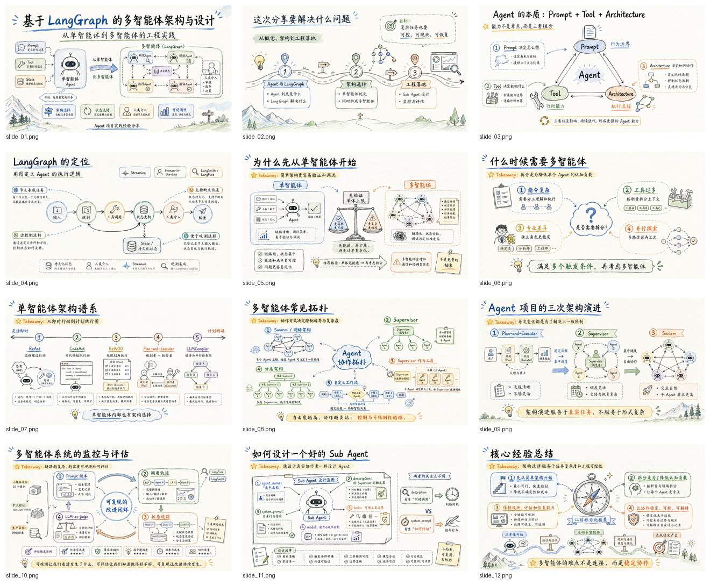
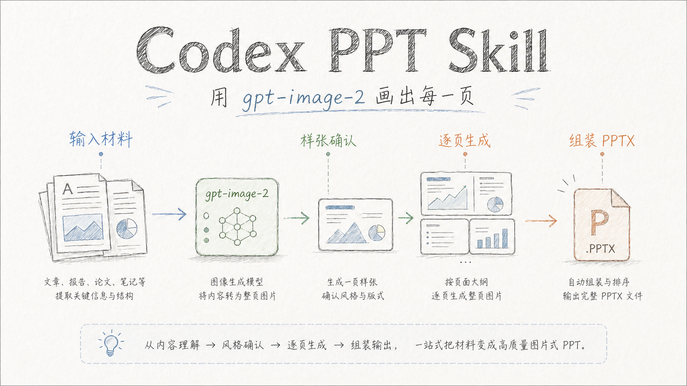

# Codex PPT Skill

一个面向 Codex 的 PPT 生成 skill。它把文章、报告、论文、课程笔记等内容转换成“整页图片式”的演示文稿：先规划大纲和视觉风格，再使用 Codex 内置的 `gpt-image-2` 生成每页幻灯片图片，最后用本地脚本组装为 `.pptx`。

## 特点

- 使用 Codex 内置的 `gpt-image-2` 生图和编辑图能力生成每页幻灯片图片
- 图片式 PPT：每页幻灯片是一张完整 16:9 图片，适合强视觉表达
- 风格参考库：内置商务、清爽专业、电子墨水杂志、手绘技术解释、仪表盘等多种风格说明
- 整套 PPT 保持统一视觉语言，但每页会按内容语义调整版式，避免机械重复
- 本地组装脚本：将 `slide_01.png`、`slide_02.png` 等图片打包成 PowerPoint

## 目录结构

```text
codex-ppt-skill/
├── README.md
├── LICENSE
├── assets/
│   └── style-previews/
└── skills/
    └── codex-ppt/
        ├── SKILL.md
        ├── requirements.txt
        ├── scripts/
        │   └── assemble_ppt.py
        └── references/
            ├── 清爽专业风.md
            ├── 创意杂志风.md
            ├── 电子墨水杂志风.md
            ├── 手绘技术解释风.md
            ├── 数据仪表盘风.md
            └── ...
```

## 安装

将 skill 目录复制或链接到 Codex skills 目录：

```bash
mkdir -p ~/.codex/skills
ln -s /path/to/codex-ppt-skill/skills/codex-ppt ~/.codex/skills/codex-ppt
```

安装 PPT 组装脚本依赖：

```bash
python3 -m venv ~/.codex/skills/codex-ppt/.venv
~/.codex/skills/codex-ppt/.venv/bin/python -m pip install -r ~/.codex/skills/codex-ppt/requirements.txt
```

## 使用方式

在 Codex 中提出类似请求：

```text
请使用 codex-ppt 把 /path/to/article.md 做成 10 页左右的 PPT，风格偏商务专业。
```

skill 会按以下流程执行：

1. 阅读内容并规划 PPT 大纲
2. 确认页数、标题和每页要点
3. 给出 2-3 个视觉风格选项，并推荐一个让用户确认
4. 使用 `gpt-image-2` 生成 1 页样张，让用户确认风格、版式节奏和文字质量
5. 创建 PPT 项目目录
6. 使用 `gpt-image-2` 逐页生成全部幻灯片图片
7. 检查文字清晰度、风格一致性和内容完整性
8. 生成 `outline.md` 和 `speech.md`
9. 使用 `assemble_ppt.py` 组装 `.pptx`

## 生成效果

下面是一套技术分享 PPT 的生成效果示例。每页都是由 `gpt-image-2` 生成的完整 16:9 幻灯片图片，再由本地脚本组装为 PPTX。



## 风格示例

以下是已生成预览图的风格，示例图均由 `gpt-image-2` 生成，用于帮助用户在开始制作前选择视觉方向。

| 清爽专业风 | 创意杂志风 |
| --- | --- |
|  |  |

| 电子墨水杂志风 | 数据仪表盘风 |
| --- | --- |
|  |  |

| 复古扁平插画风 | 手绘技术解释风 |
| --- | --- |
|  |  |

| 手绘白板风 | 温暖手工风 |
| --- | --- |
|  |  |

## 输出结构

每个 PPT 会生成一个独立项目目录：

```text
{基础目录}/{PPT名称}/
├── origin_image/
│   ├── slide_01.png
│   ├── slide_02.png
│   └── ...
├── outline.md
├── speech.md
└── {PPT名称}.pptx
```

`origin_image/` 只放正式页图片，并按 `slide_01.png`、`slide_02.png` 这样的顺序命名。样张确认时也直接使用对应页的正式文件名；如果要保留废稿或对比图，放到项目根目录或单独的 `drafts/` 目录，不要放进 `origin_image/`。

`speech.md` 会在组装时写入 PPT 的每页备注。建议使用 `## Slide 1: 标题`、`## Slide 2: 标题` 这样的标题格式，脚本会按页码匹配。

## 手动组装 PPT

如果你已经有一组幻灯片图片，可以直接运行脚本：

```bash
~/.codex/skills/codex-ppt/.venv/bin/python ~/.codex/skills/codex-ppt/scripts/assemble_ppt.py /path/to/base MyPresentation.pptx --init
```

把图片保存到 `/path/to/base/MyPresentation/origin_image/` 后，再组装 PPT：

```bash
~/.codex/skills/codex-ppt/.venv/bin/python ~/.codex/skills/codex-ppt/scripts/assemble_ppt.py /path/to/base MyPresentation.pptx --aspect-ratio 16:9
```

脚本会读取：

```text
/path/to/base/MyPresentation/origin_image/
```

只会读取 `slide_01.png`、`slide_02.png` 这类正式图片；`sample_slide.png`、草稿图、参考图会被忽略。如果项目目录下存在 `speech.md`，脚本会把对应 `Slide N` 段落写入 PPT 备注。

并输出：

```text
/path/to/base/MyPresentation/MyPresentation.pptx
```

## 适用场景

- 技术文章转分享 PPT
- 论文或报告转演示稿
- 课程笔记转课件
- 商业汇报、产品介绍、调研总结
- 需要强视觉统一性的图片式演示文稿

## 许可证

MIT

## Star History

[](https://www.star-history.com/#ningzimu/codex-ppt-skill&Date)
